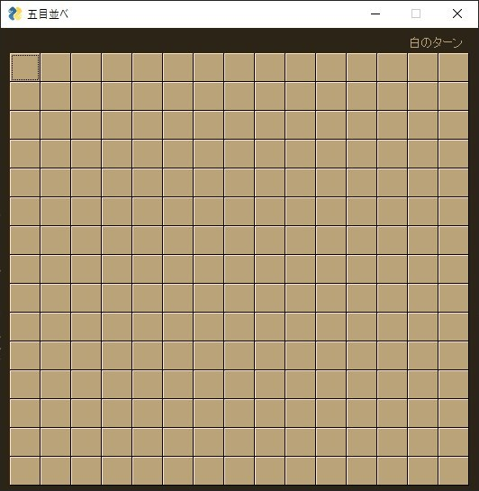
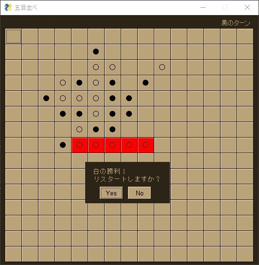

# 五目並べ

## 概要
Pythonで**五目並べ**を作ってみました。

プレイヤーが交互に石を置き、同じ色の石が5つ並べば勝利判定になる、というもので、コンピュータ対戦は実装していません。

## 必要条件
Python3.4以上、PySimpleGUIのインストールが必要です。

## 起動
「gomoku.py」をターミナル等からPythonで実行します。

「no_class/gomoku.py」はリポジトリ直下の「gomoku.py」の前身で、クラスを使わずに書いたものです。記録として残しています。

動作はWindowsでのみ確認しました。

## 完成イメージ

